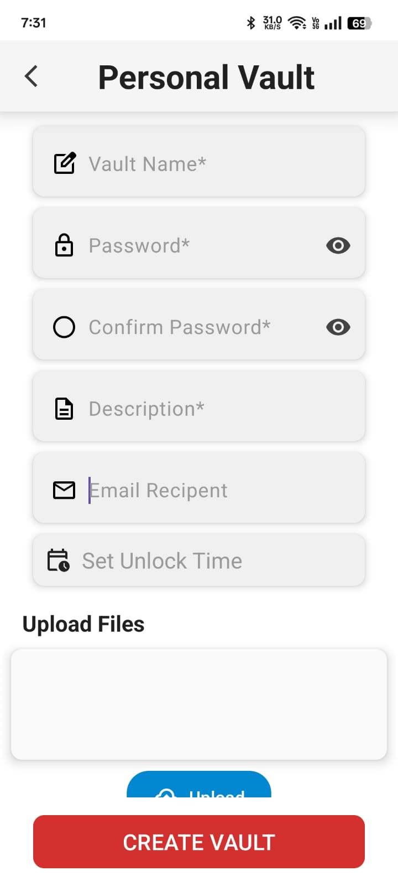

# 🔒 TimeVault – Secure Your Future Moments

**TimeVault** is a secure and intelligent data storage app that allows users to lock memories, files, and personal information inside a digital vault. The unique feature? Users set a future unlock time — and until that moment arrives, the data remains completely inaccessible.

> **"Lock it today. Unlock it tomorrow."**

---

## 🚀 Features

### 🔐 Authentication
- Firebase Email/Password Login & Signup
- Auto-login using `SharedPreferences`

### 📁 Vault System
- Create vaults with a title, unlock time, and custom password
- Upload **images, PDFs, and videos**
- View vaults as **Locked** or **Unlocked**
- **Search** by Vault Name or Vault ID  
> ⚠️ Vaults can only be unlocked **after unlock time** and **with correct password**

### 🔔 Notifications
- **FCM push notifications** when a vault unlocks
- Notifications can be deleted inside the app
- Notifications sent via backend automation

### ⚙️ App Settings
- Toggle between **Light**, **Dark**, or **System Default** themes
- View current app version
- Edit profile details
- Change / Forgot password
- Log out
- Help Center & Privacy Policy dialog

### ⏱️ Time Unlock Automation (Node.js + GitHub Actions)
- Periodically runs every 15 mins or 1 hour
- Uses Firebase Admin SDK to check unlock time
- If unlock time has passed:
  - Updates vault’s status (`isUnlocked: true`)
  - Sends **Email (via NodeMailer)**
  - Sends **Push Notification (via FCM)**
- Fully server-side: **no dependency on client timers**

---

## 🛠️ Tech Stack

| Layer         | Tools & Technologies |
|---------------|-----------------------|
| **Frontend**  | Android (Kotlin + XML), MaterialDatePicker, Lottie Animation, Animated Bottom Navigator github Link [github](https://github.com/qamarelsafadi/CurvedBottomNavigation)|
| **Architecture** | MVVM (Model-View-ViewModel) |
| **Backend**   | Firebase Auth, Firestore, Realtime DB, Node.js (GitHub Actions) |
| **Storage**   | Firestore (Vaults), Realtime DB (Users/Notifications), SharedPreferences, Cloudinary (media) |
| **UI/UX**     | CardView, RecyclerView, Bottom Sheet, AlertDialog, Floating Button, Pop-up Menu |

---

## 📦 Setup & Installation

### 🔧 Prerequisites

- Android Studio (latest version recommended)
- Firebase project with `google-services.json`
- [Cloudinary Account](https://cloudinary.com)

---

### 🛠️ Steps to Run Locally

1. **Clone the Repository**
   ```bash
   git clone https://github.com/Alok-kumar2024/TimeVault-App.git
   ```

2. **Open in Android Studio**
   - Launch Android Studio
   - Click `Open` > Select the project folder

3. **Firebase Setup**
   - Go to [Firebase Console](https://console.firebase.google.com/)
   - Select your project → Settings
   - Download `google-services.json`
   - In Android Studio:  
     - Switch to **Project View** (Top-left corner)
     - Paste `google-services.json` into the `app/` folder

4. **Cloudinary Setup**
   - Sign up at [cloudinary.com](https://cloudinary.com)
   - In Dashboard, get:
     - `cloud_name`
     - `Upload_Preset name`
         - **Steps**
             - Go To Settings
             - In Settings go to Upload
             - In that Click Add Upload Preset
             - Enter name and in signing Mode `Select Unsigned`

   - In `CloudinaryUploadWorker.kt`, replace:
     ```kotlin
     val requestBody = MultipartBody.Builder()
                .setType(MultipartBody.FORM)
                .addFormDataPart(
                    "file",
                    encrypted.name,
                    encrypted.asRequestBody("application/octet-stream".toMediaTypeOrNull()))
                .addFormDataPart("upload_preset","Your_Upload_preset Name")
                .addFormDataPart("asset_folder", folderPath)
                .addFormDataPart("public_id",File(originalName).nameWithoutExtension)
                .addFormDataPart("resource_type","raw")
                .build()

            val request = Request.Builder()
                .url("https://api.cloudinary.com/v1_1/Your_Cloud_Name/raw/upload")
                .post(requestBody)
                .build()
     ```

   - In `EditProfile_Activity.kt`, inside `uploadToCloudinary`:
     ```kotlin
     val requestBuilder =
                fileStream?.let { RequestBody.create("image/*".toMediaTypeOrNull(), it) }?.let {
                    MultipartBody.Builder()
                        .setType(MultipartBody.FORM)
                        .addFormDataPart("file","image.jpg",
                            it
                        ).addFormDataPart("upload_preset","Your_Upload_preset Name")
                        .addFormDataPart("asset_folder", folder)
                        .build()
                }

      val request = requestBuilder?.let {
                Request.Builder()
                    .url("https://api.cloudinary.com/v1_1/Your_Cloud_Name/image/upload")
                    .post(it)
                    .build()
            }
     
     ```

---

## 🖼️ Screenshots

<div style="display: flex; flex-wrap: wrap; gap: 10px;">
  
  
  
  
  
  
  
  
  
  
  
  
  
  
  
  
  
  
  
</div>


---

## 🤝 Contribution Guide

We welcome all contributions! 🛠️✨

### 📌 Steps to Contribute

1. **Fork** this repository
2. **Create a branch** (e.g. `feature/add-vault-export`)
3. **Commit** your changes with clear messages
4. **Push** to your fork
5. **Open a Pull Request** with a description

---

## 📄 License

A license for this project has not been chosen yet.

Until a license is added, contributions are welcome. Assume to be open sourced.

---

## 👨‍💻 Developer

**Alok Kumar**  
📧 Email: [02kumaralok@gmail.com](mailto:02kumaralok@gmail.com)  
🔗 LinkedIn: [linkedin.com/in/alok-kumar-3953a1321](https://www.linkedin.com/in/alok-kumar-3953a1321)  
💻 Project Repository: [TimeVault on GitHub](https://github.com/Alok-kumar2024/TimeVault-App)

---
